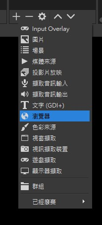
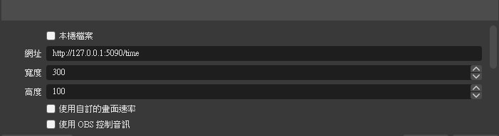
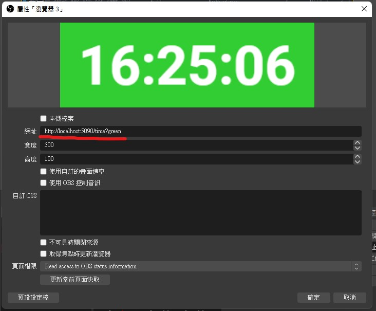
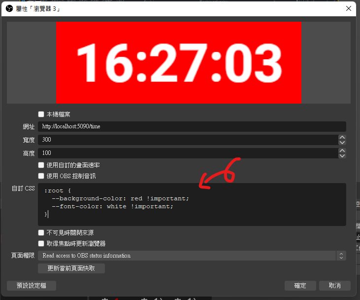
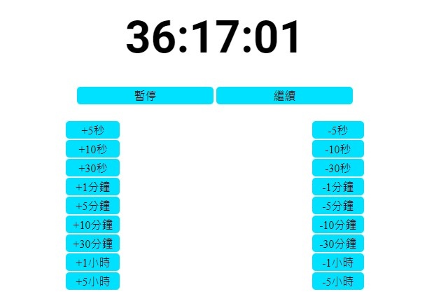

# Youtube-Marathon-Timer

現在 `加班台` 越來越流行，斗內的時間基本都是由實況主自行加於計時器上，這造成遺漏/浪費時間等問題本系統將 `Youtube` 的超級留言和加入會員等直播訊息進行統整，自動加減時間減輕直播主的困擾。

## 安裝

目前該系統只有 `Windows` 版本。如果你為其他系統請安裝 [Node.js >= 16](https://nodejs.org/zh-tw/download/) 並執行

```sh
npm i -g yarn
yarn install
yarn build
yarn start
```

1. 先行版: [點我下載](https://github.com/a3510377/youtube-work-overtime/releases/download/latest/youtube-work-overtime.zip)
2. v1.0.0: [點我下載](https://github.com/a3510377/youtube-work-overtime/releases/download/v1.0.0/youtube-work-overtime.zip)

[其它版本](https://github.com/a3510377/youtube-work-overtime/releases)

## 使用

運行 `start.bat` 等一段時間後會於該文件夾下方生成一個新的檔案 `config.yml` 請按照檔案上的註解修改該檔案並設定成你所需要的配置。
設定完後請在運行一次 `start.bat` 如果設定正確將會於 `http://localhost:5090` 顯示設定介面 ( 如果該網址被占用 系統會嘗試使用其他網址請查看視窗中的訊息 )。

## 在 OBS 上添加計時器

### 設定

請先天加一個來源 ( 瀏覽器來源 ) 並設定網址為開始視窗中打出的網址加上 `/time`。



例如:
視窗中顯示的網址為: `http://localhost:5090`
請在網址後加上: `/time`



### 自訂設定

如果你需要綠幕的版本可以在網址後加上 `?green` 即可。 ex: `http://localhost:5090/time?green`



或者你也可以自訂文字及背景顏色 可以在 OBS 對應的來源屬性中找到 `自訂 CSS` 可以打入。

```css
:root {
  --background-color: <你自訂的背景顏色> !important;
  --font-color: <你自訂的文字顏色> !important;
}
```



## 網頁設定

請在瀏覽器網址處打上 `http://localhost:5090` ( 如果該網址被占用 系統會嘗試使用其他網址請查看視窗中的訊息 )。
你會看到如下圖所示的設定介面按下上方的按鈕既可。


